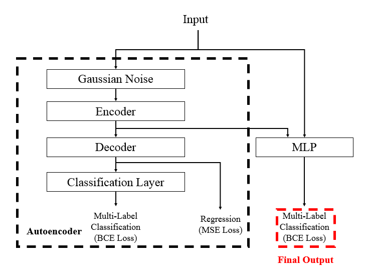

## Project Overview

This project delivers a production-ready system that decides whether to accept or skip each trading opportunity to maximize a risk-aware utility (profit with controlled volatility). I engineered a Supervised Autoencoder + MLP (AE-MLP) that learns denoised, predictive representations from noisy market features and converts them into high-precision trade actions. The model is trained jointly per time-series fold with a multi-task objective—reconstruction (MSE) plus auxiliary and main classification (BCE)—capturing stable structure while staying sharply aligned to directional returns.

To ensure robustness, the pipeline applies purged, grouped time-series cross-validation with a 31-day embargo, preventing temporal leakage and mirroring real-world deployment. Features are imputed causally (forward-fill, then zero), and training is economically weighted toward samples with larger absolute returns, focusing learning where P&L impact is highest.

At inference, I average multi-horizon predictions (and optionally multiple seeds) and apply a calibrated threshold to deliver stable, high-precision actions. Model selection uses validation AUC on the main head, directly supporting post-threshold decision quality under the competition’s utility metric.

**Tech stack:** TensorFlow/Keras, scikit-learn, pandas/numpy, datatable; time-aware CV and ML ops patterns suitable for productionization.

## Dataset Description

**What a row represents.** Each row is a **trading opportunity** for which the model decides whether to **take** the trade (`action = 1`) or **skip** it (`action = 0`).

**Core fields**
- **Anonymized features:** `feature_0 … feature_129` — 130 numeric signals derived from real market data.  
- **Targets / returns (train only):** `resp`, `resp_1`, `resp_2`, `resp_3`, `resp_4` — realized returns at different horizons.  
- **Scoring weight:** `weight` — row importance in the competition’s utility. Rows with `weight = 0` are included for completeness but **do not** affect the score.  
- **Time columns:**  
  - `date` — trading-day index (used to group rows by day).  
  - `ts_id` — within-day order (ensures causal predictions).

**Scale** ~**1 million** training rows (historical data). The hidden test set was served via a time-series API and updated during the live phase.

### Schema at a Glance

| Column(s)                       | Type  | Train | Test | Description |
|---|---|:--:|:--:|---|
| `feature_0 … feature_129`      | float | ✓ | ✓ | Anonymized market features used as model inputs. |
| `date`                         | int   | ✓ | ✓ | Trading-day index; used for grouped, time-aware validation and day-level scoring. |
| `ts_id`                        | int   | ✓ | ✓ | Within-day order to preserve causality. |
| `weight`                       | float | ✓ | ✓ | Row importance in the utility score; `weight = 0` rows don’t contribute to scoring. |
| `resp`                         | float | ✓ |     | Primary realized return (training signal). |
| `resp_1, resp_2, resp_3, resp_4` | float | ✓ |     | Returns at alternative horizons (auxiliary training signals). |

## Methodology & Approach

I designed and implemented an end-to-end, production-style pipeline that converts anonymized market features into calibrated trade decisions. The approach emphasizes **leakage control**, **economic alignment**, and **stability**—properties that matter in real trading as much as they do on a leaderboard.

---

## Utility Metric

For each date $i$, define daily profit:

$$ p_i = \sum_{j} {({{weight}} \cdot {{resp}} \cdot {action})}  $$

Annualized Sharpe-like factor:

$$
t = \frac{\sum_{i} p_i}{\sqrt{\sum_{i} p_i^{2}}}\sqrt{\frac{250}{|i|}}
$$

Utility:

$$
u = \min(\max(t,0),6)\sum_{i} p_i
$$

**Objective:** maximize $\sum_{i} p_i$ while maintaining low day-to-day variance (high $t$).

---

### Architecture

## Loss Functions & Optimization

### Multi-Task Heads
- **Reconstruction head (`decoder`)** — Rebuilds the 130-dimensional feature vector to enforce a stable, denoised latent space.
- **AE Auxiliary head (`ae_action`)** — Five-output, multi-label classifier (one per return horizon) that injects directional supervision into the encoder.
- **Main head (`action`)** — Five-output, multi-label classifier that drives the trading decision.

### Training Objectives
- **Reconstruction loss (MSE):** Aligns reconstructions with inputs to stabilize representation learning under noisy features.
- **AE auxiliary loss (BCE, 5 horizons):** Makes the latent representation predictive of return direction across horizons.
- **Main loss (BCE, 5 horizons):** Trains the classifier used for action selection.
- **Total objective:** Sum of the three losses above; **label smoothing = 0**.

### Leakage Mitigation
- Replaced pretraining with **joint per-fold training** so the autoencoder and classifier learn only from each fold’s training window, eliminating cross-fold information bleed.

### Economic Weighting
- **Per-row weight:** Mean absolute return across the five horizons (`resp`, `resp_1`…`resp_4`).
- **Application:** Apply the same weight to **all heads** (reconstruction and both classification losses) so every component of the objective emphasizes economically impactful rows.

### Optimization & Regularization
- **Optimizer:** Adam (`lr = 1e-3`), batch size ~`4096`, up to `100` epochs.
- **Regularization:** Gaussian noise on inputs (variance control), Batch Normalization (stable large-batch training), Dropout (overfit control), and **Swish** activations (smooth gradients).
- **Training protocol:** **Joint training within each time-series fold** (no cross-fold pretraining) to keep objectives consistent and leakage-free.

### Model Selection & Checkpointing
- **Early stopping:** Monitor **validation AUC (main head)** with patience ~`10`; restore the best epoch.
- **Artifacts:** Persist best weights per fold.
- **Metrics tracked:** AUC for AE and Main heads; MAE for the reconstruction head.

### Post-Training Calibration
- **Aggregation:** Average the five horizon probabilities; optionally average across seeds/folds to reduce variance.
- **Thresholding:** Calibrate a single cutoff on out-of-fold predictions to **maximize the utility**, then use the same threshold at test time.

## Process

### 1) Load and Filter
- Load `train.csv`. Keep rows where **`date > 85`** (removes the early regime shift) and **`weight > 0`** (focuses training on rows that affect the utility).
- Extract the **feature columns** (`feature_0`…`feature_129`), **time columns** (`date`, `ts_id`), and **return columns** (`resp`, `resp_1`, `resp_2`, `resp_3`, `resp_4`).

### 2) Causal Imputation
- Forward-fill each feature using only past observations to preserve causality.
- Fill any remaining missing values with zero so tensors are dense and consistent at both training and inference time.

### 3) Supervision (Labels)
- Create five binary labels, one for each return horizon: a label is **1** if the corresponding return is positive, otherwise **0**.
- Create a strict composite label that is **1** only when **all** horizons are positive.

### 4) Cross-Validation Design
- Use **5-fold Purged Group TimeSeriesSplit** with **`date`** as the grouping key and a **31-day embargo** between training and validation windows to prevent temporal leakage.
- Generate **out-of-fold (OOF) predictions** in every fold to support threshold tuning on truly held-out data.

### 5) Joint Training per Fold
- Train a **Supervised Autoencoder + MLP** within each fold so the encoder and classifier co-adapt **without cross-fold leakage**.
  - **Encoder:** dense layer with 96 units, batch normalization, Swish activation; preceded by a Gaussian noise layer for regularization.
  - **Decoder:** reconstructs the 130-dimensional input; trained with mean squared error.
  - **AE Auxiliary Head:** dense layers with batch normalization, Swish, and dropout; outputs **five sigmoid probabilities** trained with binary cross-entropy.
  - **Main Classifier:** concatenate batch-normalized inputs with the **96-dimensional latent** vector; apply an MLP with hidden sizes **896, 448, 448, 256**, each with batch normalization, Swish, and dropout; output **five sigmoid probabilities** trained with binary cross-entropy.
- **Optimization:** Adam (learning rate **1e-3**), label smoothing **0**, batch size ~**4096**, up to **100** epochs; **EarlyStopping** (patience ~**10**) and **ModelCheckpoint** on **validation AUC of the main head**.
- **Independent problem-solving:** identified potential **label leakage** from pretraining and **replaced it with joint per-fold training**, eliminating cross-fold information bleed.

### 6) Economics-Aware Sample Weighting
- For each row, compute a **training weight** as the **mean absolute return** across the five horizons.
- **Apply weights uniformly across all losses** (reconstruction and both BCE heads) so learning emphasizes **high-impact** observations end-to-end.

### 7) Model Selection and Artifacts
- Select the **best epoch** in each fold by **validation AUC (main head)** and persist the corresponding **weights**.
- Favor models from **later folds** or train **multiple seeds** to increase stability.

### 8) Inference and Probability Aggregation
- For each validation or test segment, generate **five horizon probabilities** from the main head.
- **Average** the five probabilities to reduce variance; also average across **multiple seeds** or **selected folds**.

### 9) Thresholding to Actions
- Convert averaged probabilities to the final **`action ∈ {0, 1}`** using a **calibrated cutoff**.
- **Threshold objective:** tune the decision threshold on **OOF predictions** to **maximize the utility** (not just AUC). Sweep thresholds between 0 and 1 on held-out data, compute day-level profit and stability, choose the threshold that yields the highest utility, and **use the same threshold at test time**.

